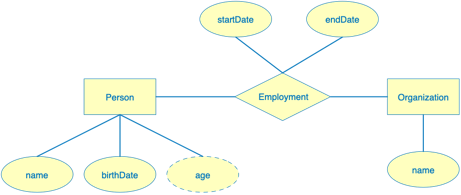

This project contains a minimal chenup project.

This is using the initial public release of chneup, 0.1.0.

Prerequisites:
- Java 25
- Maven
- Docker

1. Save this project in a convenient location. We will refer to this as simplechenup from this point on.
2. cd simplechenup
3. Build the application: mvn clean package
4. Create and run a docker postgres container: docker run --name chenup-postgres -e POSTGRES_PASSWORD=mysecretpassword -p 5432:5432 -d postgres:18
5. Run the database initialization script: docker exec -i chenup-postgres psql -U postgres < init.sql
6. Run the application: java -jar target/simplechenup.jar

This illustrates a simple chenup application that implements the following ER diagram:

The application creates a person object and an organization object and connects them with an employment association.

